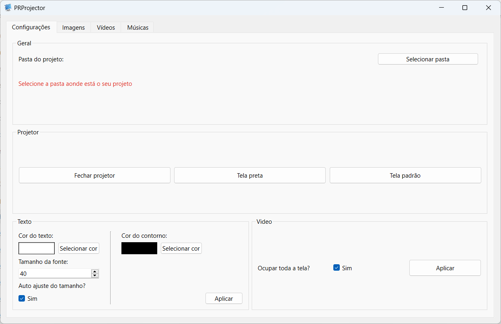

# PRProjector

[](https://github.com/paulocoutinhox/prprojector/actions/workflows/macos.yml)
[](https://github.com/paulocoutinhox/prprojector/actions/workflows/win-x64.yml)
[](https://github.com/paulocoutinhox/prprojector/actions/workflows/win-arm64.yml)

Software to show images, videos, texts and lyrics on datashow or any external monitor and display.

<p align="center"><a href="https://github.com/paulocoutinhox/prprojector" target="_blank" rel="noopener noreferrer"></a></p>

<p align="center"><a href="https://github.com/paulocoutinhox/prprojector" target="_blank" rel="noopener noreferrer"></a></p>

## Download

Get your version on release page.

## Requirements to build

- Python 3
- PIP

## How to build for macOS (x64)

1 - Install python requirements:

```
python3 -m pip install -r requirements.txt
```

2 - Call build for your platform:

```
python3 make.py run build-macos
```

## How to build for Windows (x64)

1 - Install python requirements:

```
python3 -m pip install -r requirements.txt
```

2 - Call build for your platform:

```
python3 make.py run build-win-x64
```

## How to build for Windows (arm64)

1 - Install python requirements:

```
python3 -m pip install -r requirements.txt
```

2 - Call build for your platform:

```
python3 make.py run build-win-arm64
```

## How to encode certificates on macOS

Run on terminal:

```
base64 -i distribution.p12 | pbcopy
base64 -i mac_installer.p12 | pbcopy
```

On certificate type is "Apple Distribution" and the other is "Mac Installer Distribution".
