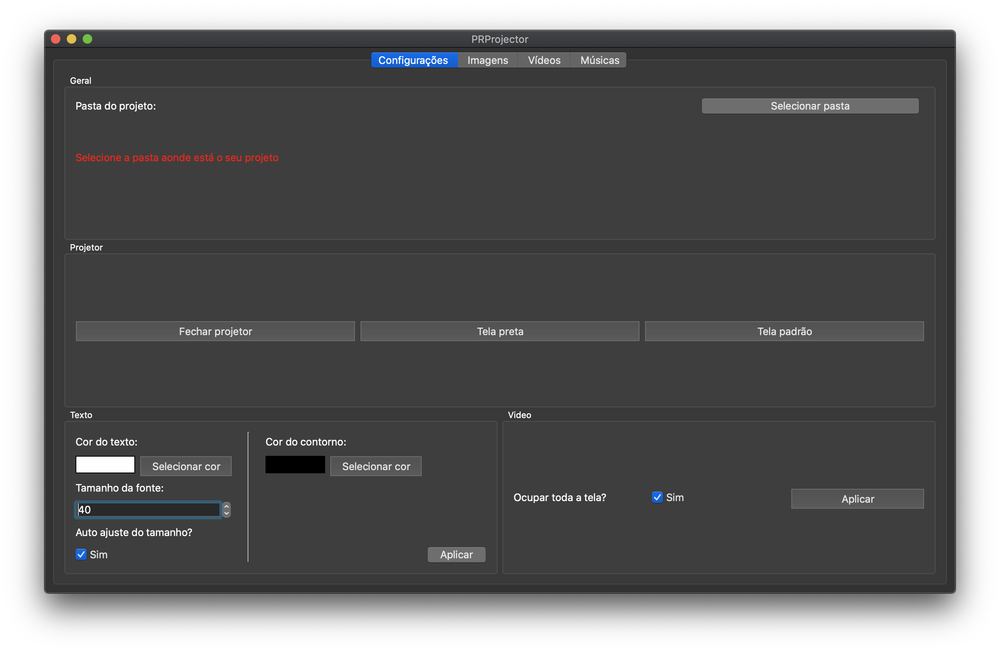

# PRProjector

Software to images, videos, texts and lyrics on datashow or any external monitor/display.

<p align="center"><a href="https://github.com/paulo-coutinho/prprojector" target="_blank" rel="noopener noreferrer"></a></p>

## Download

Get your version on release page.

## Requirements to build

- Python 3

## How to build

1 - Install python requirements:

```
pip install -r requirements.txt
```

2 - Call build for your platform:

```
python make.py build-macos

or

python make.py build-linux

or

python make.py build-windows
```
